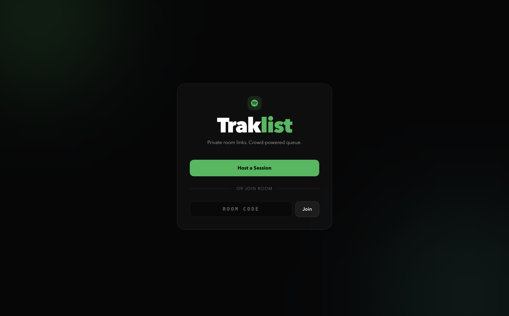
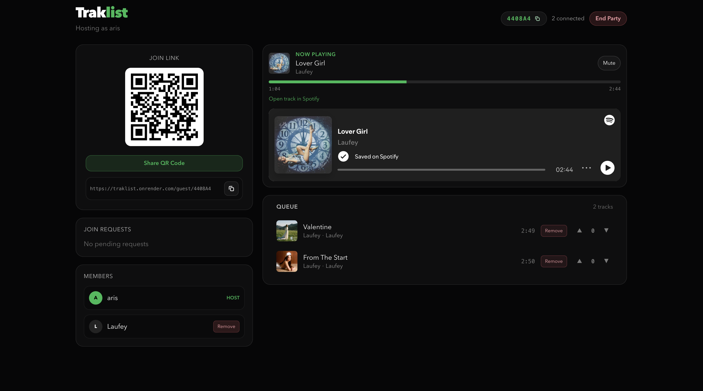
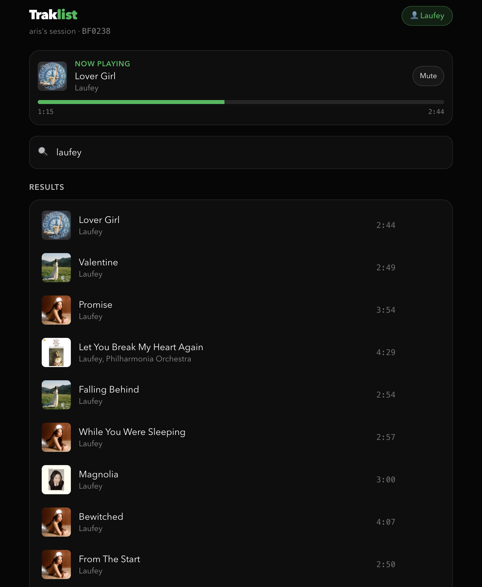

# Traklist

Traklist is a live group music queue web app.  
Hosts start a room, guests join with a room code, and everyone helps shape the queue in real time.

## Live App

Use Traklist here:  
[https://traklist.onrender.com](https://traklist.onrender.com)

---

## How It Works

### 1) Start or Join
- Host clicks **Host a Session**
- Guests enter the room code to request access

### 2) Host Lobby Controls
- Share room with code, link, or QR
- Approve or reject join requests
- Remove members or songs from queue
- End room when finished

### 3) Guest Room Experience
- Search songs
- Add songs to queue
- Vote tracks up/down
- Leave room any time

---

## Core Features
- Real-time queue updates via Socket.IO
- Host approval flow before guests can interact
- Queue voting (upvote/downvote)
- Host moderation tools (remove members and queue items)
- Persistent room/member behavior until host ends session
- Mobile-friendly host/guest UI

---

## Tech Stack
- **Frontend:** React, Vite, Tailwind CSS, Framer Motion
- **Backend:** Node.js, Express, Socket.IO
- **Music:** Spotify Web API
- **Hosting:** Render (live), optional local dev

---
